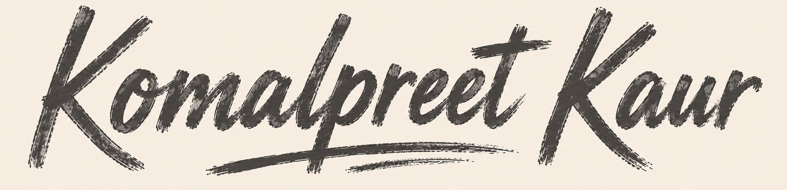

  

---

  <b>AI/ML Engineer</b> 
  Building agentic AI, LLM inference systems, and multimodal models — speech, vision, memory.

---

### Tech Stack & Skills

| **Programming Languages** | **Machine Learning & AI** |
| :--- | :--- |
|  |  |
| **Generative AI & RAG** | **Full-Stack & Systems** |
|      |  |

---

### Let's Connect

**Open to collaborations and hiring.**

  
  
  
  

